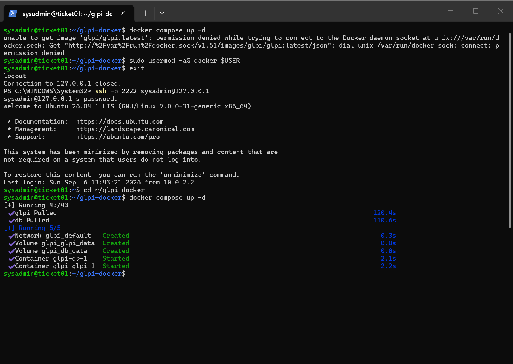
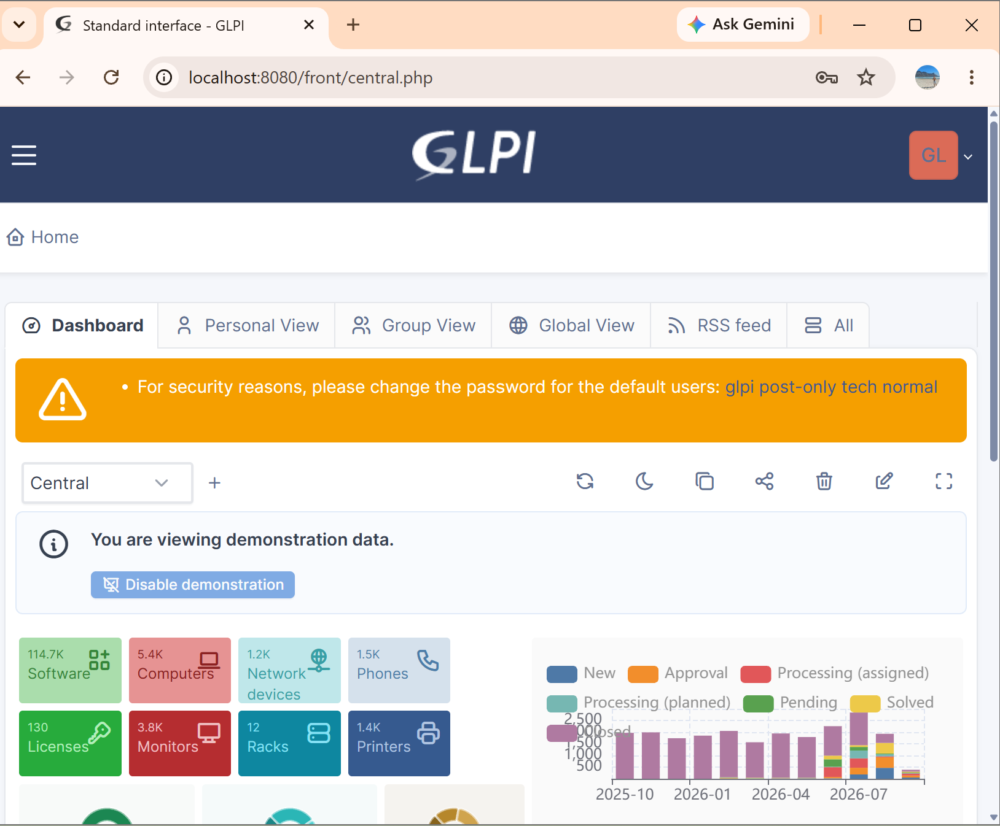
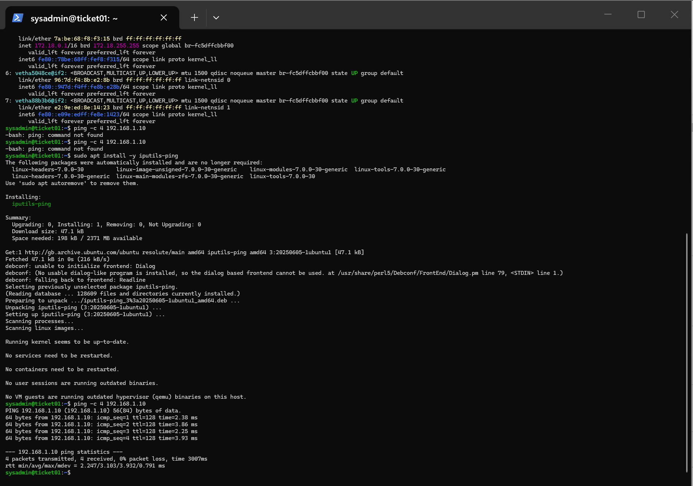
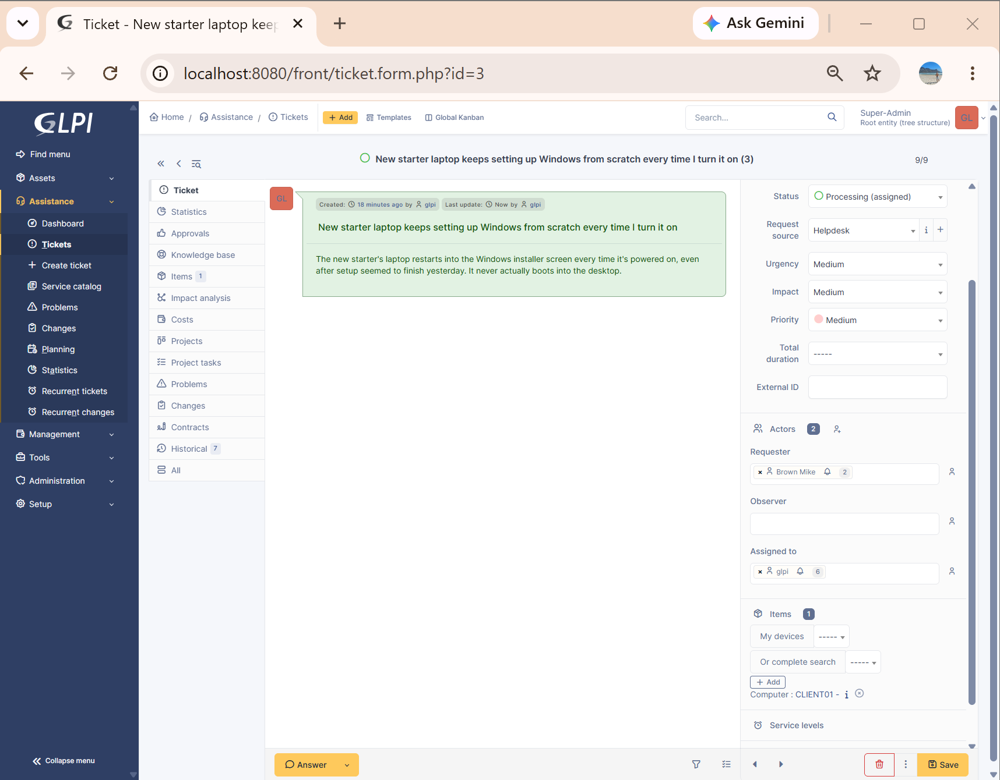
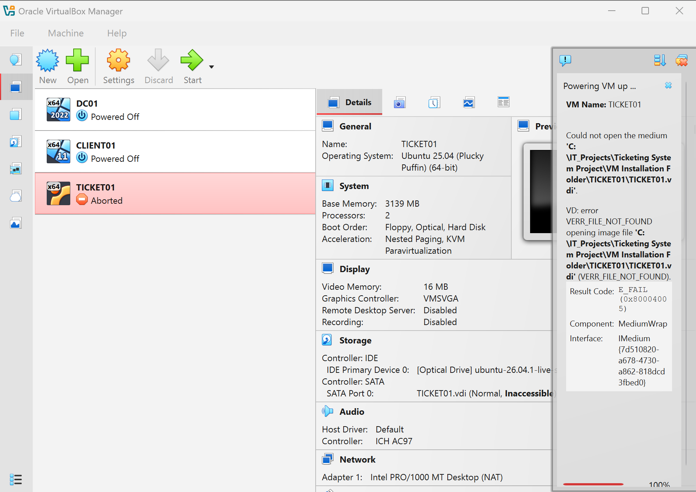
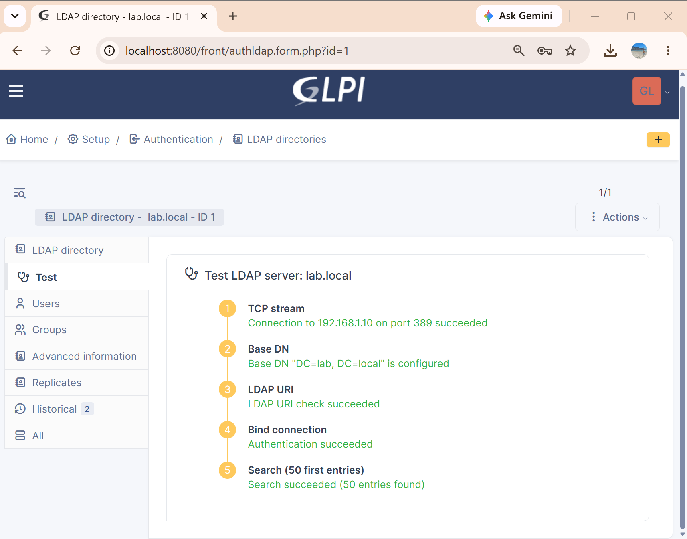
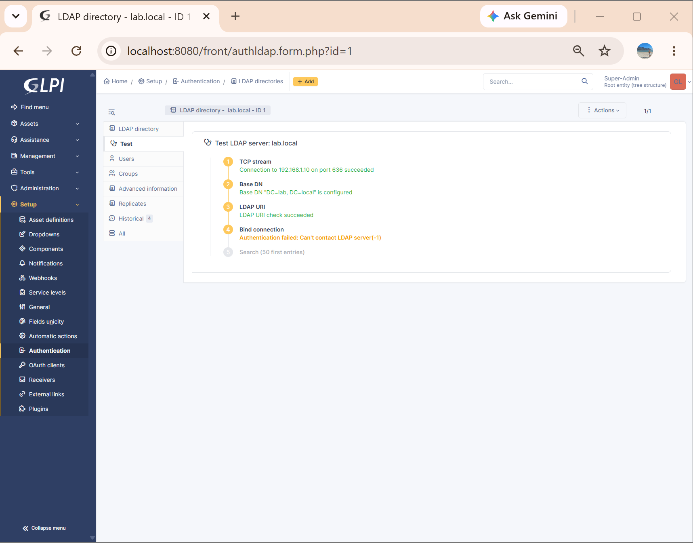
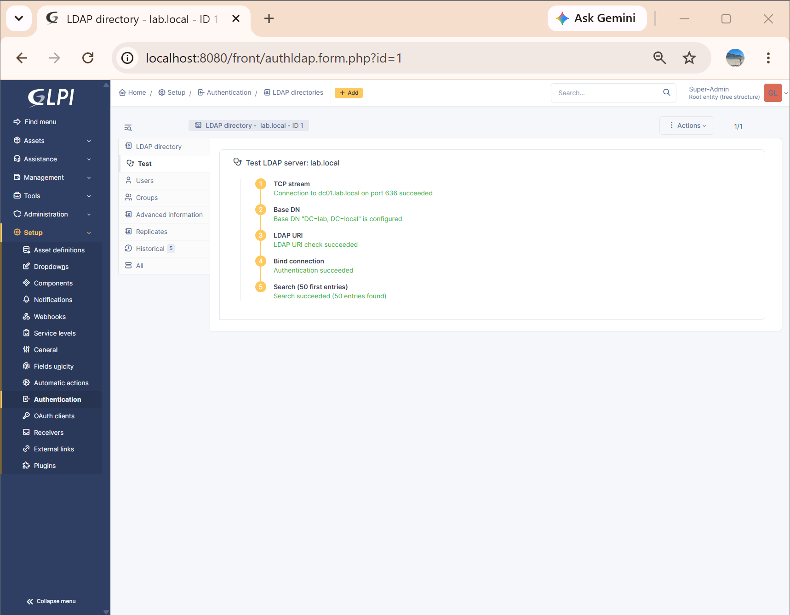

# Helpdesk Ticketing Lab: TICKET01

A self-hosted GLPI ticketing system built in VirtualBox and integrated with the existing `lab.local` Active Directory environment, simulating a small company's IT service desk.

Built over 6-7 September 2026, extending [active-directory-lab](../active-directory-lab). TICKET01 joins DC01 and CLIENT01 on the same isolated network, authenticating against the same domain.

## Project Goal

To add a service-desk layer on top of an existing enterprise IT environment: deploy an open-source ITSM tool, integrate it with Active Directory for real user authentication (upgraded to encrypted LDAPS with a real internal CA), and populate it with a realistic ticket history drawn from genuine issues hit while building the infrastructure itself.

## Environment Overview

| Component | Details |
|---|---|
| Hypervisor | Oracle VirtualBox 7.2.16 |
| Domain Controller | `DC01`, Windows Server 2025 (see active-directory-lab) |
| Ticketing Server | `TICKET01`, Ubuntu Server 26.04.1 LTS, minimized install |
| Ticketing Software | GLPI (official `glpi/glpi` Docker image) + MySQL, via Docker Compose |
| Domain | `lab.local` |
| Networking | Dual-homed: NAT (management/internet) + isolated `LabNetwork` (same as DC01/CLIENT01) |
| TICKET01 LabNetwork IP | `192.168.1.30` (static, via netplan) |
| DNS | Points to DC01 (`192.168.1.10`) |
| Remote access | SSH from Windows PowerShell, via NAT port-forward (host `2222` → guest `22`) |
| GLPI web access | Browser via NAT port-forward (host `8080` → guest `80`) |
| LDAP / LDAPS | `lab.local`, authenticated against DC01, port 636 (encrypted) |

TICKET01 sits on the same isolated internal network as the existing domain controller and client, reflecting how a real internal service-desk server would sit inside a company's LAN rather than being a bolt-on SaaS tool. It is dual-homed: one adapter for host management (NAT), a second dedicated purely to talking to the domain (LabNetwork). This is the same pattern real servers use to separate management traffic from production traffic.

## Architecture Overview

```
                     Internet
                        │
                        ▼
                  VirtualBox NAT
                        │
         ┌──────────────┴──────────────┐
         │                              │
       DC01                        TICKET01
  (Windows Server 2025)        (Ubuntu Server, Docker)
         │                              │
         │                    ┌─────────┴─────────┐
         │                    │                   │
         │                  GLPI               MySQL
         │                    │
         │   LDAPS :636 (encrypted, internal CA: lab-DC01-CA)
         │◄───────────────────┘
         ▼
  Active Directory (lab.local)
         ├── jsmith
         ├── mbrown
         └── Sarahjones

                 LabNetwork (isolated internal)
                        │
                    CLIENT01
```

GLPI (on TICKET01) authenticates against DC01 over LDAPS rather than plain LDAP. See Troubleshooting Log, Issues 6-11, for the full path from a plaintext workaround to a properly trusted, hostname-verified, persistent TLS configuration.

## Design Rationale

GLPI was chosen over other open-source options (osTicket, Zammad) specifically because it combines ticket management with native LDAP/Active Directory authentication, allowing genuine integration with the existing domain rather than a standalone tool with its own separate user base. This mirrors how commercial ITSM platforms commonly referenced in UK IT support job listings (ServiceNow, Freshservice) integrate with corporate directory services.

**Security rationale:**
- A dedicated, least-privilege service account (`svc-glpi-ldap`) binds to LDAP, not a personal admin account
- No real credentials are committed to this repo: `.env` and the real LDAPS certificate/config are excluded via `.gitignore`; `.env.example` documents the required variables without real values
- LDAPS (port 636, internal CA) replaces the original plain-LDAP-with-relaxed-signing workaround once the production-correct fix was built (see Issue 6 and Section 10 below)
- GLPI's built-in demo data was disabled, so no placeholder assets/tickets ship with the deployed instance

## What Was Built

### 1. TICKET01 VM provisioning
Ubuntu Server 26.04.1 LTS installed via VirtualBox unattended installation (minimized install), initially on NAT networking to allow package downloads.


### 2. Remote administration via SSH
OpenSSH installed during setup; administered remotely from Windows PowerShell via a NAT port-forwarding rule (host `2222` → guest `22`) rather than the local VirtualBox console.

### 3. Docker & GLPI deployment
Docker Engine and Docker Compose installed via Ubuntu's official repository. GLPI deployed via the official `glpi/glpi` image, paired with a MySQL container, defined in `docker-compose.yml`.



### 4. First GLPI access
A second NAT port-forwarding rule (host `8080` → guest `80`) exposed GLPI's web interface. GLPI auto-installed its database schema on first run, skipping straight to a working login screen.



### 5. Dual-homed networking for LabNetwork integration
A second adapter (`enp0s8`) was added to TICKET01 on the isolated `LabNetwork`, given a static IP (`192.168.1.30/24`) via netplan, continuing the addressing scheme from the AD lab (DC01 `.10`, CLIENT01 `.20`). The original NAT adapter was left untouched, so remote management was never lost.



### 6. LDAP integration with lab.local
A dedicated least-privilege service account (`svc-glpi-ldap`) was created in a new `Service-Accounts` OU on DC01 for this integration. GLPI's LDAP directory was configured to bind using this account. It initially failed over plain LDAP due to DC01's default signing enforcement (Issue 6), then was resolved. jsmith, Sarah Jones, and Mike Brown were imported from their respective OUs as real GLPI users.

### 7. Ticket categories & templates
Five categories created matching real IT support taxonomy: Hardware, Software, Network, Account & Access, and Active Directory.

### 8. Realistic ticket population
Nine tickets created across all three imported AD users and all five categories, mixing genuine technical incidents drawn from this project's own troubleshooting log with ordinary day-to-day helpdesk volume:

| # | Title | Requester | Category | Status |
|---|---|---|---|---|
| 1 | New server (TICKET01) failed to boot after setup | jsmith | Active Directory | Closed |
| 2 | Can't get GLPI to authenticate against AD, login keeps failing | jsmith | Active Directory | Closed |
| 3 | New starter laptop keeps setting up Windows from scratch every time I turn it on | mbrown | Active Directory | Processing |
| 4 | My wallpaper policy isn't applying even though IT said they fixed it | Sarahjones | Active Directory | Processing |
| 5 | Locked out of my account after too many password attempts | mbrown | Account & Access | Closed |
| 6 | Printer in Sales not responding | Sarahjones | Hardware | Processing |
| 7 | Can't connect to the office Wi-Fi from my laptop | jsmith | Network | Processing |
| 8 | Need Excel installed on my new PC | mbrown | Software | Processing |
| 9 | New starter needs a Finance-Department account setup | Sarahjones | Account & Access | Processing |

Three tickets (the RCU stall, the LDAP signing failure, and an account lockout) were resolved with real, specific solution text and closed. The remainder was left in "Processing" status, reflecting a realistic snapshot of an active service desk rather than a fully-wrapped demo.


### 9. Asset inventory
GLPI's asset side was populated with the three real lab machines (DC01, CLIENT01, TICKET01). Ticket #3 was linked to its real subject asset (CLIENT01) via the ticket's Items tab, demonstrating GLPI's asset-ticket relationship rather than tickets existing as disconnected text records.



### 10. LDAPS: replacing the signing workaround with real encryption
The original LDAP integration (Section 6) worked over plain LDAP on port 389, only after relaxing DC01's signing requirements, a deliberate lab simplification rather than a production-correct fix. This stretch goal replaced it with genuine LDAPS (port 636) backed by a real internal Certificate Authority:

- Installed AD CS on DC01 as an Enterprise Root CA (`lab-DC01-CA`); DC01 auto-enrolled its own Domain Controller certificate
- Exported the CA certificate and trusted it inside the `glpi` container via `TLS_CACERT`
- Diagnosed and fixed a TLS hostname-verification mismatch (GLPI was connecting by IP; the certificate's subject is the hostname). See Issues 7-10
- Made the entire fix persistent through `docker-compose.yml` (a bind-mounted `ldap-config` volume plus an `extra_hosts` entry), verified against a **full container rebuild**, not just a restart

GLPI now authenticates against `lab.local` over genuinely encrypted LDAPS, with the entire trust and hostname-resolution configuration defined declaratively rather than living only inside a running container's memory.

Full step-by-step screenshots for each stage are in the `Screenshots` folder (48 in total, numbered in build order).

## Setup & Deployment

### Prerequisites
- Oracle VirtualBox 7.2.16+
- An existing Active Directory domain reachable from TICKET01 (see [active-directory-lab](../active-directory-lab) for building one from scratch)
- Ubuntu Server 26.04.1 LTS ISO
- Docker Engine & Docker Compose

### Installation Steps

1. **Provision the VM**, dual-homed: one adapter on NAT (management), one on the same internal network as your domain controller.

2. **Install Docker**, then clone this repo onto the VM:
   ```
   git clone https://github.com/JackBraun01/helpdesk-ticketing-lab.git
   cd helpdesk-ticketing-lab
   ```

3. **Configure environment variables**: copy the template and fill in real values (never commit the result):
   ```
   cp .env.example .env
   nano .env
   ```

4. **Deploy GLPI + MySQL:**
   ```
   docker compose up -d
   ```

5. **Configure LDAP** in GLPI's web UI (Setup → Authentication → LDAP directories), pointing at your domain controller with a dedicated service account.

6. **Upgrade to LDAPS** (recommended over plain LDAP):
   - Stand up an Enterprise Root CA on your domain controller (AD CS role) and export its certificate
   - Place the exported `.pem` and a matching `ldap.conf` (with a `TLS_CACERT` line) into `./ldap-config/`. This folder is bind-mounted into the container automatically via `docker-compose.yml`
   - In GLPI's LDAP directory settings, set the Server field to `ldaps://<your-dc-hostname>` and Port to `636`

### Verification
```
docker compose ps
nc -zv <dc-hostname> 636
docker exec -it glpi-glpi-1 getent hosts <dc-hostname>
docker compose down && docker compose up -d   # confirm config survives a full rebuild
```
Then re-run GLPI's built-in LDAP connection test (Setup → Authentication → LDAP directories → Test) and confirm all five stages pass.

## Troubleshooting Log

Real issues encountered and resolved during the build, included deliberately, since diagnosing and fixing genuine problems (not just following steps that work first time) is what actually demonstrates capability.

| # | Issue | Root Cause | Resolution |
|---|---|---|---|
| 1 | TICKET01 VM registered in VirtualBox but failed to boot with `VERR_FILE_NOT_FOUND`, "Could not open the medium" | The virtual hard disk (`.vdi`) file never actually finished being created during VM creation, despite the VM's configuration files registering successfully | Removed the broken VM registration, recreated the VM, and explicitly inspected the "Specify virtual hard disk" panel before clicking Finish |
| 2 | TICKET01 boot hung indefinitely at "Loading essential drivers" during install, with no progress after 10+ minutes | Kernel-level RCU stall caused by a timing/scheduling desync between VirtualBox 7.2.x and multi-core Linux guests, a known, currently open issue on VirtualBox's tracker | Reduced the VM's allocated CPU count from 2 to 1. Before concluding this was the cause, ruled out a corrupted ISO (SHA256 checksum matched Canonical's published hash exactly) and host resource contention |
| 3 | `docker compose up -d` failed with `permission denied while trying to connect to the Docker daemon socket` | A freshly created non-root user isn't automatically granted access to Docker's restricted Unix socket, which requires explicit `docker` group membership | Added the user to the `docker` group (`sudo usermod -aG docker $USER`), then fully logged out and reconnected, since group membership only applies to a new session |
| 4 | Browser could not reach GLPI (`ERR_CONNECTION_REFUSED`), despite the container working correctly internally | Only an SSH (port 22) NAT forwarding rule existed; port 80 had no rule, so the host browser had no route in | Added a second NAT port-forwarding rule (host `8080` → guest `80`) |
| 5 | Second adapter's static IP failed to apply; `netplan apply` errored with `unknown key 'enp0s8'` | The netplan YAML was accidentally overwritten rather than appended to while editing, leaving incorrect indentation | Rebuilt the netplan file from scratch with correct nesting for both adapters, verifying structure with `cat -A` before reapplying |
| 6 | GLPI's LDAP test failed with `Strong(er) authentication required(8)` at Bind connection | Windows Server 2025 enforces LDAP signing by default, rejecting unsigned binds over plain LDAP (port 389) | Relaxed LDAP signing requirements via Group Policy as a deliberate, documented lab simplification, flagged at the time as the reason a production-correct LDAPS fix (Section 10) was needed |
| 7 | After switching to LDAPS, GLPI's test passed TCP/Base DN/LDAP URI but failed at Bind with `Can't contact LDAP server(-1)` | The TLS handshake was rejected because the `glpi` container's isolated trust store had never been told to trust the new internal CA | Exported the CA certificate and registered it via `TLS_CACERT` in the container's `ldap.conf` |
| 8 | Certificate text pasted into the SSH session landed directly at the bash prompt instead of inside a file | `nano` hadn't been opened first, and pasting multi-line text straight at a shell prompt causes bash to interpret each line as a command | Opened `nano lab-DC01-CA.pem` first, then pasted the still-available clipboard content into the editor |
| 9 | `mkdir /etc/ldap` inside the container failed with `Permission denied`; running `docker` commands from inside the container failed with `command not found` | `docker exec` connects as the low-privilege `www-data` user by default; `docker` itself is a host-level CLI tool not installed inside the container | Re-ran container commands with `docker exec -u root` from the TICKET01 host shell |
| 10 | After adding `TLS_CACERT`, the identical bind failure persisted | GLPI connected via DC01's IP (`ldaps://192.168.1.10`), but the certificate's subject is `CN=DC01.lab.local`, a TLS hostname-verification mismatch. The container also couldn't resolve the hostname at all (separate DNS from the host VM) | Added a direct `/etc/hosts` entry inside the container and switched GLPI's Server field to the hostname. All five test stages passed |
| 11 | A `cat > file << 'EOF'` heredoc paste corrupted `docker-compose.yml` with duplicated, malformed content | The heredoc's closing `EOF` merged with a second, duplicate paste on the same line with no line break, so bash never recognized the terminator and kept absorbing input | Deleted the file and re-ran the exact same heredoc as a single, uninterrupted paste, confirming with `cat` before proceeding |

## Evidence

Screenshots are split into two numbered sequences: `doc-NN` (standard build steps) and `ts-NN` (errors/troubleshooting and their fixes), in the `Screenshots` and `Troubleshooting` folders respectively.

### Issue 1: Missing virtual disk file


### Issue 6: LDAP signing enforcement fix confirmed


### Issue 10: TLS hostname mismatch, resolved


### Final result: LDAPS fully working and persistent


## Repository Structure

```
helpdesk-ticketing-lab/
├── docker-compose.yml     # GLPI + MySQL service definitions, incl. persistent LDAPS volume mount and extra_hosts entry
├── ldap-config/
│   ├── ldap.conf          # TLS_CACERT directive trusting the internal lab CA
│   └── lab-DC01-CA.pem    # Exported root certificate from DC01's Enterprise CA
├── Screenshots/           # doc-NN build-step images, numbered in build order
├── Troubleshooting/       # ts-NN error/fix images, numbered in build order
├── .env.example           # Template for required environment variables (actual .env is gitignored)
├── .gitignore
└── README.md              # This file
```

*Not included in this repo (excluded via `.gitignore`):* the real `.env` file and the actual `lab-DC01-CA.pem`/`ldap.conf` from a live deployment. Clone this repo for the pipeline and configuration pattern, not a working credential set.

## Known Limitations

- **DNS resolution uses a static `extra_hosts` entry** rather than pointing the container at the domain controller's own DNS service. This works reliably for a single-DC lab, but in a larger environment, configuring the container's actual DNS resolver (rather than a hardcoded hosts-file entry) would scale better and avoid maintaining IP mappings by hand.
- **Ticket volume is a fixed seed set** (9 tickets) rather than an ongoing stream; there's no automation generating new tickets over time.
- **Single LDAP source**: only `lab.local` is configured; no fallback or secondary directory.
- **The GLPI container's LDAPS trust config is bind-mounted, not baked into a custom image**: anyone deploying this from scratch needs to populate `ldap-config/` themselves rather than pulling a pre-configured image.
